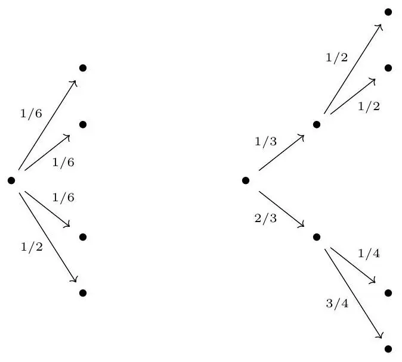

+++
title = "Shannon Entropy"
description = "This is an extension of the notes that I wrote for my talk at the \"What is...?\" seminar organized by the Math Club at ISI Bangalore."
type = ["blogs","blog"]
# tags = [
#     "go",
#     "golang",
#     "templates",
#     "themes",
#     "development",
# ]
date = "2024-01-24"
# categories = [
#     "Development",
#     "golang",
# ]
# series = ["Hugo 101"]
[ author ]
  name = "Hrishik Koley"
+++



## Introduction
Entropy is a measure of the randomness or chaos in a system. From an information theoretic point of view, entropy corresponds to the number of possible outcomes of a given event. For better understanding, we need to understand what is information. Simply put, the greater the entropy of an event before it occurs, the greater is the information that we gain after the event has taken place.

## Shannon Entropy
Consider 3 coin tosses, there are 8 possible outcomes here. The lowest number of bits we need to transmit this information is \\(\log_{2}8=3\\).

Thus in any event \\(U\\) with \\(n\\) outcomes, where all the outcomes are equally likely, we can encode our outcome using \\(\log_{2}n\\) bits. That is precisely the entropy of this event, that is, \\(\mathbb{H}=-\log_{2}n\\).

For the case where not all outcomes are equally likely the entropy is simply, \\(\mathbb{H}=-\sum_{i=1}^n p_{i}\log p_i\\)

## Some Characterizations

**Shannon's characterization**

We start with the man himself. Shannon wanted a reliable measure of ’information’ of a process (specifically a Markov process, but that’s irrelevant for us). He quite successfully recognised that information is somehow correlated with the amount of uncertainty of the result of some event. He considered that there is a relation between probabilities and uncertainties and ’choices’.

To quote him :
> _Suppose we have a set of possible events whose probabilities of occurrence are \\(p_1,p_2,\dots,p_n\\). These probabilities are known but that is all we know concerning which event will occur. Can we find a measure of how much “choice” is involved in the selection of the event or of how uncertain we are of the outcome?_

He considers such a measure \\(\mathbb{H}_n(p_1,p_2,...,p_n)\\) (if it exists) to follow the Shannon's characterization.

Shannon's characterization states the following criteria:

- \\(\mathbb{H}_n\\) is continuous in the \\(p_i\\).
- If all the probabilities are equal, then \\(\mathbb{H}_{n+1} \ge \mathbb{H}_n\\), that is \\(\mathbb{H}\\) is monotonically increasing in \\(n\\).
- If a choice be broken down into two successive choices, the original \\(\mathbb{H}_n\\) should be the weighted sum of the individual values of \\(\mathbb{H}_n\\).

The first two criteria are quite easy to visualize but we would like to have an example for the third criteria. Let us consider an example.

Let, \\(p=(p_1,p_2)=\left(\frac{1}{3},\frac{2}{3}\right)\\); and \\(q(1)=\left(\frac{1}{2},\frac{1}{2}\right)\\), and \\(q(2)=\left(\frac{1}{4},\frac{3}{4}\right)\\).

The corresponding trees look like

and the third criterion reads

\\(\mathbb{H}_4\left(\frac{1}{6}, \frac{1}{6}, \frac{1}{6}, \frac{1}{2}\right)=\mathbb{H}_2\left(\frac{1}{3}, \frac{2}{3}\right)+\frac{1}{3} \mathbb{H}_2\left(\frac{1}{2}, \frac{1}{2}\right)+\frac{2}{3} \mathbb{H}_2\left(\frac{1}{4}, \frac{3}{4}\right)\\)

> **Theorem.** The only function that satisfies these criteria is \\(\mathbb{H}=-K\sum_{i=1}^n p_{i}\log p_i\\), where \\(K>0\\) is a constant.

> **Proof:** We follow Shannon's proof. Let \\(\mathbb{H}_{n}\left(\frac{1}{n}, \frac{1}{n}, \ldots, \frac{1}{n}\right)=A(n)\\). We can decompose a choice from \\(s^{m}\\) equally likely possibilities into a series of \\(m\\) choices from \\(s\\) equally likely possibilities and hence by criteria 3.
    $$
    A\left(s^{m}\right)=m A(s)
    $$
Similarly \\(A\left(t^{n}\right)=n A(t)\\). Let $n$ be large enough such that we can find an \\(m\\) to satisfy
    $$
    s^{m} \leq t^{n} \leq s^{m+1}
    $$
Then
    $$
    \frac{m}{n} \leq \frac{\log t}{\log s} \leq \frac{m}{n}+\frac{1}{n} \Rightarrow\left|\frac{m}{n}-\frac{\log t}{\log s}\right|<\epsilon
    $$
for some arbitrarily small \\(\epsilon\\). Now, since $A(n)$ is monotonic (criteria 2),
    $$
    A\left(s^{m}\right) \leq A\left(t^{n}\right) \leq A\left(s^{m+1}\right) \Rightarrow m A(s) \leq n A(t) \leq(m+1) A(s)
    $$
Thus by a similar argument
    $$
    \left|\frac{m}{n}-\frac{A(t)}{A(s)}\right|<\epsilon
    $$
and hence
    $$
    \left|\frac{A(t)}{A(s)}-\frac{\log t}{\log s}\right|<2 \epsilon \Rightarrow A(t)=K \log t
    $$
where \\(K>0\\) to satisfy criteria 2.\
Now suppose we have \\(n\\) possibilities with probability \\(p_i=\frac{n_i}{\sum_i n_i}\\) such that \\(n_i \in \mathbb{N}\\) (that is, the probabilities are rational). Now we break down a choice from \\(\sum_i n_i\\) possibilities into a choice from $n$ possibilities with probabilities \\(p_i\\), and then if the $i$-th choice was chosen, a choice from \\(n_i\\) with equal probabilities. \
Applying criteria 3
    $$
    K \log \left(\sum_{i} n_{i}\right)=\mathbb{H}_{n}\left(p_{1}, p_{2}, \ldots, p_{n}\right)+K \sum_{i} p_{i} \log n_{i}
    $$
Solving for \\(\mathbb{H}\\) gives
    $$
    \begin{aligned}
    \mathbb{H}_{n}\left(p_{1}, p_{2}, \ldots, p_{n}\right) & =K\left[\sum_{i} p_{i} \log \left(\sum_{i} n_{i}\right)-\sum_{i} p_{i} \log n_{i}\right] \\
    & =-K \sum_{i} p_{i} \log \left(\frac{n_{i}}{\sum_{i} n_{i}}\right) \\
    & =-K \sum p_{i} \log p_{i}
    \end{aligned}
    $$
If the probabilities are not rational, then they may be approximated by rationals and since we assume that \\(\mathbb{H}\\) is continuous, the same result must hold in the limit as well. Hence the expression holds for any set of probabilities.

**Surprise Characterization**

One way that seems very natural is to quantify how much 'surprising' an event is. The more information an event provides, the more surprising it is. What events surprise us more? Events with low probability. So 'surprise' seems to be a decreasing function of probability.

The surprise characterization has the following criteria:
- \\(\mathbb{S}(x)\\) is continuous.
- \\(\mathbb{S}(x)\\) a decreasing function of \\(x\\).
- \\(\mathbb{S}(xy) = \mathbb{S}(x)+\mathbb{S}(y)\\).

The entropy satisfies \\(\mathbb{H}(A) = \mathbb{P}(A)\mathbb{S}(\mathbb{P}(A))\\).
> **Theorem.** \\(\mathbb{S}(\mathbb{P}(A))\\) is of the form \\(-K\log\mathbb{P}(A)\\) for some constant \\(K \ge 0\\) and thus, \\(\mathbb{H} = -K\sum_{i=1}^n p_i\log p_i\\).

> **Proof:** Criteria 3 tells us that for indepenedent events $A$ and \\(B\\), we have
    $$
    \mathbb{S}(\mathbb{P}(A) \mathbb{P}(B))=\mathbb{S}(\mathbb{P}(A))+\mathbb{S}(\mathbb{P}(B))
    $$
This is a form of Cauchy's functional equation. Along with criteria 1, this has solutions of the form
    $$
    \mathbb{S}(\mathbb{P}(A))=K \log \mathbb{P}(A)
    $$
Criteria 2 then tells us that \\(K<0\\), or placing a negative sign on the solution we have
    $$
    \mathbb{S}(\mathbb{P}(A))=-K \log \mathbb{P}(A)
    $$
with \\(K>0\\). \
Now plugging $\mathbb{S}(\mathbb{P}(A))$ into the expression for $\mathbb{H}$, we get:
    $$
        \mathbb{H} = -K\sum_{i=1}^n p_i\log p_i
    $$

**Fadeev-Leinster Characterization**

This is a fairly recent characterization.
The criteria of this characterization are: 
- \\(\mathbb{H}\\) is continuous.
- \\(\mathbb{H}\\) is invariant under bijections.
- \\(\mathbb{H}(1)=0\\).
- \\(\mathbb{H}\\) satisfies strong additivity, that is, for properly defined probability distributions \\(p=(p_1, p_2,...,p_n)\\) and \\(q(i)\\) for \\(1 \leq i \leq n\\), \\(\mathbb{H}\\) satisfies
    $$
    \mathbb{H}(\bigoplus_{i=1}^np_iq(i))=\mathbb{H}(p_1,p_2,...,p_n)+\sum_{i=1}^np_i\mathbb{H}(q(i)
    $$

We will be stating two theorems without proofs which will be made use of in a short while.
> **Theorem. 1** For any real valued sequence \\(\left\{a_{n}\right\}\\), if
    $$
    a_{n+1}-\frac{n}{n+1} a_{n} \rightarrow 0
    $$
then
    $$
    a_{n+1}-a_{n} \rightarrow 0
    $$

> **Theorem. 2 (_Erd\H{o}s, K\'atai, M\'at\'e_)** Let \\(\phi\\) be a function on the natural numbers such that
    $$
    \phi(n m)=\phi(n)+\phi(m)
    $$
Now, if
    $$
    \lim _{n \rightarrow \infty}(\phi(n+1)-\phi(n))=0
    $$
then
    $$
    \phi(n)=K \log n
    $$
for some constant \\(K\\).

Now we come to another important theorem, which we will give the proof for.
> **Theorem.** The only function that satisfies the Fadeev-Leinster criteria is of the form \\(\mathbb{H}(X)=\\) \\(-K \sum_{i \in X} p_{i} \log p_{i}\\).

> **Proof:** Let us define
    $$
    \phi(n)=\mathbb{H}\left(\frac{1}{2}, \frac{1}{2}, \ldots, \frac{1}{2}\right)
    $$
The strong additivity tells us that
    $$
    \begin{align*}
    \phi(m n) & =\mathbb{H}\left(\frac{1}{m n}, \frac{1}{m n}, \ldots, \frac{1}{m n}\right) \\
    & =\mathbb{H}\left(\frac{1}{n}, \frac{1}{n}, \ldots, \frac{1}{n}\right)+\frac{1}{n} \sum_{i=1}^{n} \mathbb{H}\left(\frac{1}{m}, \frac{1}{m}, \ldots, \frac{1}{m}\right) \\
    & =\phi(n)+n \frac{1}{n} \mathbb{H}\left(\frac{1}{m}, \frac{1}{m}, \ldots, \frac{1}{m}\right) \\
    & =\phi(n)+\phi(m)
    \end{align*}
    $$
    The tree we used here is (for $n=3, m=2$ )\\
    \includegraphics[max width=0.65\textwidth, center]{images/2024_03_16_385be7e6a9ca554722f2g-07.jpg}
    This also implies that $\phi(1)=0$.
    Now note that
    $$
    (\underbrace{\frac{1}{n+1}, \ldots, \frac{1}{n+1}}_{n+1 \text { times }})
    $$
    can be written in two steps, the first having two choices with probability $\frac{n}{n+1}$ and $\frac{1}{n+1}$, and the second step having $n$ choices with probability $\frac{1}{n}$ for the former, and 1 choice with probability 1 for the latter. The relevant tree for $n=4$ is\\
    \includegraphics[max width=0.7\textwidth, center]{images/2024_03_16_385be7e6a9ca554722f2g-08.jpg}
    Then by strong additivity (and the fact that $\phi(1)=0$ ),
    $$
    \phi(n+1)=\mathbb{H}\left(\frac{n}{n+1}, \frac{1}{n+1}\right)+\frac{n}{n+1} \phi(n)
    $$
    Thus
    $$
    \phi(n+1)-\frac{n}{n+1} \phi(n)=\mathbb{H}\left(\frac{n}{n+1}, \frac{1}{n+1}\right) \rightarrow \mathbb{H}(1,0)
    $$
    What is $\mathbb{H}(1,0)$ ? Well
    $$
    \begin{gathered}
    \mathbb{H}(1,0,0)=\mathbb{H}(1(1,0) \oplus 0(1))=\mathbb{H}(1,0)+1 \mathbb{H}(1,0)+0 \mathbb{H}(1)=2 \mathbb{H}(1,0) \\
    \mathbb{H}(1,0,0)=\mathbb{H}(1(1)+0(1,0))=\mathbb{H}(1,0)+1 \mathbb{H}(1)+0 \mathbb{H}(1,0)=\mathbb{H}(1,0)
    \end{gathered}
    $$
    and hence $\mathbb{H}(1,0)=0$
    Well then,
    which by the lemma tells us that
    $$
    \phi(n+1)-\frac{n}{n+1} \phi(n) \rightarrow 0
    $$
    $$
    \phi(n+1)-\phi(n) \rightarrow 0
    $$
    and thus the theorem tells us that
    $$
    \phi(n)=K \log n
    $$
    for some constant $K$.
    
    The rest of the proof is the same as in the second part of Shannon's proof (after he shows what form his $A$ function takes), replacing $A$ by $\phi$, and thus we do not repeat that here, but the upshot is obviously the statement of the theorem, that is
    $$
    \mathbb{H}(X)=-K \sum_{i \in X} p_{i} \log p_{i}
    $$
\end{proof}
\section{Applications of Shannon Entropy}
Shannon entropy has a wide range of applications in various fields from mathematics to biology to theoretical computer science.\\
Some applications are:
\begin{enumerate}
    \item \textbf{Data Compression:} Shannon entropy finds it's use in optimizing storage and transmission as well as in various compression algorithms.
    \item \textbf{Communication Systems:} It helps in assessing the efficiency of information transmission and is closely related to channel capacity.
    \item \textbf{Cryptography:} It is used in assessing the strength of encryption systems and also to evaluate the potential risks faced by cryptographic systems.
\end{enumerate}
\section{Data Compression}
 The goal of compression is to represent signals (or more general data) in a more efficient form. Compression is extremely useful for both storage and transmission. The basic idea of compression is exploiting redundancy in data. Sampling and quantization are considered forms of compression. Sampling is a form of lossless compression. Quantization is a form of lossy compression. It is defined as the process of mapping continuous infinite values to a smaller set of discrete finite values. In lossless compression, from the compressed data one is able to reproduce the original data exactly. In lossy compression, the original data cannot be reproduced exactly. Rather we allow some degradation in the reproduced data.
\subsection{The Coding Problem}
Suppose we are given $M$ symbols denoted $s_1,s_2,\dots,s_M$. For example, for images and video we might have $M=256$ with the symbols $s_i$ denoting the $256$ grayscale levels. For general text files, we might have $M=128$ (as in ASCII) with the $s_i$ denoting $128$ characters including upper and lower case letters, digits, punctuation marks, and various special symbols.\\
\\
How many bits do we need per symbol? The obvious answer is that we need $log_2M$ bits. For example, if there are $8$ symbols $s_1,\dots,s_8$, then we can use the codewords $000, 001, 010, 011, 100, 101, 110, 111$.\\
\\
Every codeword must correspond to a different symbol otherwise the representation does not give back the original symbols. It is easy to see that when we do not have any additional information then it is not possible to come up with better codewords and this representation is the best we can do. However, if additional information is provided then we can try to do something.
\subsection{Fixed-length and Variable-length Coding}
Fixed-length coding refers to the situation where we have equal length codewords for every symbol. However, this is not the case in variable-length coding. In variable-length coding we assign shorter codewords to more frequently used symbols and longer codewords to less frequently used symbols.\\
\\
Consider four symbols $s_1,s_2,s_3,s_4$. With the standard (fixed-length) encoding we would need $2$ bits/symbol. But if the probabilities of their occurence are known as follows: $1/2$ for $s_1$, $1/4$ for $s_2$, and $1/8$ for $s_3$ and $s_4$. We can come up with a variable-length coding as follows: $0$ represents $s_1$, $10$ represents $s_2$, $110$ represents $s_3$, and $111$ represents $s_4$. Now the average number of bits needed for symbol is $(1)(1/2)+(2)(1/4)+(3)(1/8)+(3)(1/8)=1.75$.
 \subsection{Issues in Variable-length Coding}
 There arise some problems in variable-length coding:
 \begin{enumerate}
     \item \textbf{Unique Decodability:} With variable length codes, in addition to not having two symbols with the same codeword, we also have to worry about some combination of symbols giving the same string of bits as some other combination of symbols. Suppose for four symbols $s_1,s_2,s_3,s_4$ we assign the codewords $0, 10, 01, 11$ respectively. Then we can’t tell whether 0110 corresponds to $s_3s_2$ or $s_1s_4s_1$. This shows that this particular code is not uniquely decodable.
     \item \textbf{Instantaneous Codes:}  A code is called instantaneous if each symbol can be decoded as soon as the corresponding codeword is completed. That is, it is not necessary to see bits of later symbols in order to decode the current symbol. The code $0, 01, 011, 111$ for the symbols $s_1,s_2,s_3,s_4$, respectively is not instantaneous. To see this, consider the bit stream $011111\dots1$. We can’t tell if the first symbol is $s_1,s_2$, or $s_3$, although it’s clear that after this first symbol we have a sequence of $s_4$’s. Once we see the last $1$, we can then work backwards to eventually find out what was the first symbol.
 \end{enumerate}
\subsection{Role of Shannon Entropy in Data Compression}
Since $\mathbb{H}$ represents the average number of bits of information per symbol from the source, we might expect that we need to use at least $\mathbb{H}$ bits per symbol to represent the source with a uniquely decodable code. This is in fact the case, and moreover, if we wish to code longer and longer strings of symbols, we can find codes whose performance (average number of bits per symbol) gets closer to $\mathbb{H}$. This result is called the source coding theorem and was discovered by Shannon in 1948.
\begin{theorem}(\textbf{Source Coding Theorem})
    \begin{enumerate}
        \item The average number of bits/symbol of any uniquely decodable source must be greater than or equal to the entropy $\mathbb{H}$ of the source.
        \item  If the string of symbols is sufficiently large, there exists a uniquely decodable code for the source such that the average number of bits/symbol of the code is as close to $\mathbb{H}$ as desired.
    \end{enumerate}
\end{theorem}
\subsection{Huffman Coding}
Huffman coding is a simple and systematic way to design good variable-length codes given the probabilities of the symbols. The resulting code is both uniquely decodable and instantaneous.\\
The Huffman coding algorithm can be summarized as follows:
\begin{enumerate}
    \item Think of the $p_i$ as the leaf nodes of a tree. In constructing a Huffman code by hand it’s sometimes useful to sort the pi in decreasing order.
    \item  Starting with the leaf nodes, construct a tree as follows. Repeatedly join two nodes with the smallest probabilities to form a new node with the sum of the probabilities just joined. Assign a $0$ to one branch and a $1$ to the other branch. In constructing Huffman codes by hand, it’s often helpful to do this assignment in a systematic way, such as always assigning $0$ to the branch on the same side.
    \item The codeword for each symbol is given by the sequence of $0$’s and $1$’s starting from the root node and leading to the leaf node corresponding to the symbol.
\end{enumerate}
\subsection{Notable facts about Huffman Coding}
\begin{enumerate}
    \item  It can be shown that that $\mathbb{H} \leq$ average length of Huffman code $\leq \mathbb{H}+1$.
    \item The time complexity for finding the Huffman code for $n$ many symbols is $T(n)=T(n-1)+O(n)$, and thus, it follows $O(n^2)$.
\end{enumerate}
